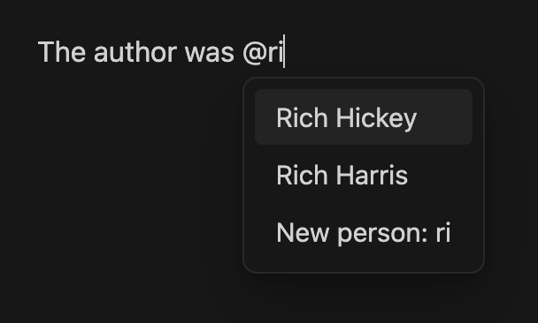
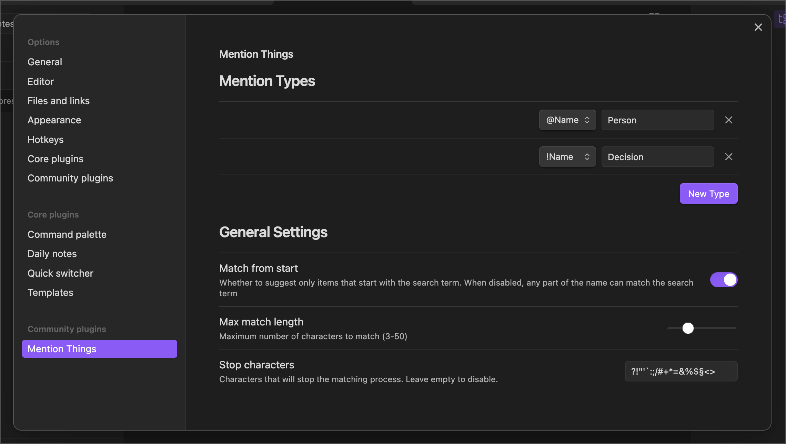

# Obsidian - Mention Things

Obsidian plugin that adds support to mention other notes via customizable signs. Most commonly used to `@`-mention people:



When you hit enter on a suggestion, it'll create a link that looks like this:

```
The author was [[@Rich Hickey]]
```

and leave the cursor at the end.

**Credits:**
This plugin is based on [saibotsivad/obsidian-at-people](https://github.com/saibotsivad/obsidian-at-people) by Tobias Davis

## Options



### Mention Types
**Character** - The symbol (like "@" or "#") that triggers the suggestion box while typing. Each character can be associated with a different type of mention.

**Label** - A descriptive name (like "Person" or "Project") that appears in the suggestion box when creating new entries. This helps identify what type of content you're creating.

### General Settings
**Match from start** - When enabled, only suggests items that begin with your search term. Recommended for faster, more precise matching.

**Max match length** - Limits how many characters you can type before suggestions stop appearing. Prevents suggestions from showing when typing longer text that happens to start with a mention character.

**Stop characters** - Any character in this list will immediately close the suggestion box when typed. Helpful for quickly dismissing suggestions when you type punctuation or special characters.

## License

Published and made available freely under the [Very Open License](http://veryopenlicense.com/).
